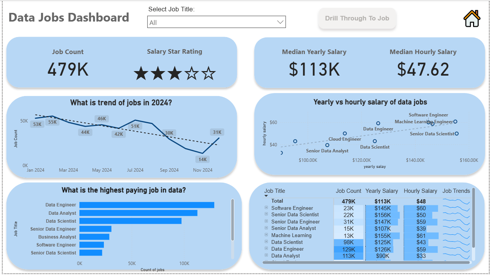

# Job Data Visualization – Power BI

## Overview
This is a practice project for data analysis and visualization using Power BI. The dashboard provides insights into the job market, including top job titles, average salaries, job count by category.

## Tools & Technologies
- Power BI Desktop
- Datasets: Job listings data (public / sample)
- Git & GitHub for version control

## Features
- Interactive dashboards with slicers for filtering data
- Data cleaning and preparation using Power Query
- Visualizations: Bar charts, line charts, tables

## How to Use
1. Download the `.pbix` file from this repository
2. Open it in Power BI Desktop
3. Explore the interactive visualizations

## Learning Outcomes
- Practiced data cleaning and preparation
- Learned to create interactive dashboard
- Developed skills in data visualization and storytelling

## Notes
This project is a self-study exercise and demonstrates beginner-level data analysis skills.
